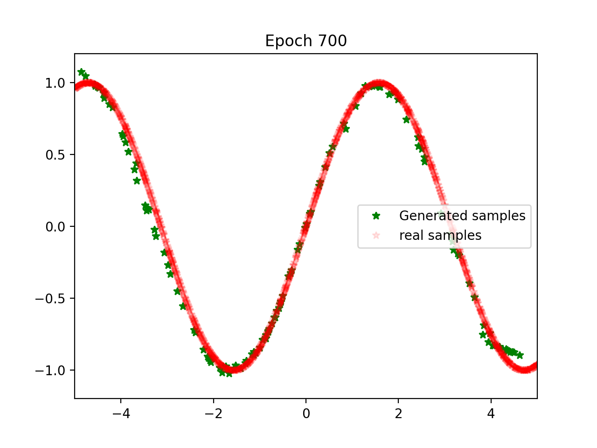

# 🧠 Vanilla GAN: Learning Sine Function from Scratch

A Generative Adversarial Network (GAN) trained from scratch using PyTorch to learn the shape of `y = sin(x)` — with no explicit formula given to the Generator.

## 📌 Overview

| | |
|---|---|
| 🎯 **Goal** | Generate points matching `y = sin(x)` |
| 🛠️ **Tools** | PyTorch, Matplotlib, NumPy |
| 📐 **Architecture** | Fully connected Generator + Discriminator |
| 📊 **Data** | 2048 synthetic sine curve samples |
| ⏱️ **Training** | 700 epochs with Early Stopping |

## 🏗️ Architecture

**Discriminator (D):** `2 → 256 → 128 → 64 → 1`
- Classifies `(x, y)` pairs as real or generated
- ReLU activations + Dropout(0.3)
- Sigmoid output

**Generator (G):** `2 → 16 → 32 → 2`
- Takes random noise as input
- Outputs `(x, y)` pairs resembling the sine curve

## 📈 Results

After ~700 epochs, the Generator successfully learned the sine curve shape:



Green ★ = Generated samples · Red · = Real sine data

## 🚀 How to Run

Open in Kaggle:

[](https://www.kaggle.com/code/mirjaloleshmurodov/vanilla-gan-learning-sine-function-from-scratch)

Or run locally:
```bash
pip install torch matplotlib numpy
jupyter notebook vanilla-gan-learning-sine-function-from-scratch.ipynb
```

## 💡 Key Concepts

| Concept | Description |
|---------|-------------|
| **Adversarial Training** | G and D improve by competing against each other |
| **Implicit Learning** | G learned sine without ever seeing the formula |
| **Early Stopping** | Training halts automatically when progress stagnates |
| **Mini-Batching** | Efficient training with 128-sample batches |
